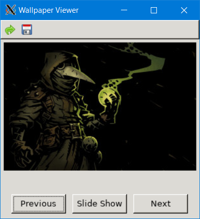

# Random-Picture
> Downloads a random image from wallhaven.cc and saves it as your desktop wallpaper.

This is a rewrite of my [randPic](https://github.com/clamytoe/randPic) script that does almost the same thing, but all in Python. This version cuts down on the calls to the site by cycling through all of the images that are scraped on each pass. Once those images have been cycled through, another request is made for more.

## Setup
If you already have requests and BeautifulSoup4 installed, nothing more is needed. Simply run the script. If not, you can quickly setup a virtual environment by performing either of the following steps:

```bash
git clone https://github.com/clamytoe/Random-Picture.git
cd Random-Picture
```

If using venv:
```bash
python3 -m venv venv
source ./venv/bin/activate
pip install -r requirements.txt
```

If using [Anaconda](https://anaconda.org/):
```bash
conda env create -f environment.yml
source activate rpic
```

## Running the script
I've written the script so that default actions are performed by simply hitting any key, usually just the *Enter* key. The default action is denoted by the **[ ]** brackets. Simply keep going until you find an image that you like. If you like the image and would like to save it, simply enter a **y** when asked to back it up and when you are ready to stop the script, enter an **n** when it asks if you would like a different image.
```bash
python rpic.py
Retrieved: Anime 1920x1080 anime Bleach
Backup the image (y/[n])?
Would you like a different image([y]/n)?
Retrieved: People 1202x800 gamers Fnatic
Backup the image (y/[n])?
Would you like a different image([y]/n)?
Retrieved: Anime 1920x1174 Clannad anime Sakagami Tomoyo Fujibayashi Kyou Sunohara Yôhei
Backup the image (y/[n])?
Would you like a different image([y]/n)?
Retrieved: General 1920x1080 nature landscape
Backup the image (y/[n])?
Would you like a different image([y]/n)?
Retrieved: People 2048x1363 women model brunette blue eyes portrait Eraj Asadi
Backup the image (y/[n])?
Would you like a different image([y]/n)?
Retrieved: General 1920x1080 The Witcher 3: Wild Hunt video games
Backup the image (y/[n])? y
Would you like a different image([y]/n)? n
```

## Using the GUI Interface

I've added a graphical interface in order to be able to preview the images before downloading the full size one.

```bash
python gui.py
```



*  Retrieve a new set of images
*  Save the current image
*  Load the previous image
*  Start the slideshow
*  Load the next image

> Note: The slideshow button turns into a STOP button when it's running so that you can stop it.
